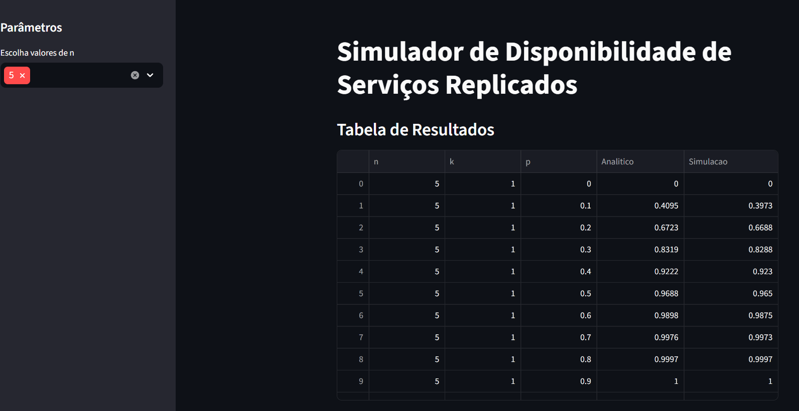
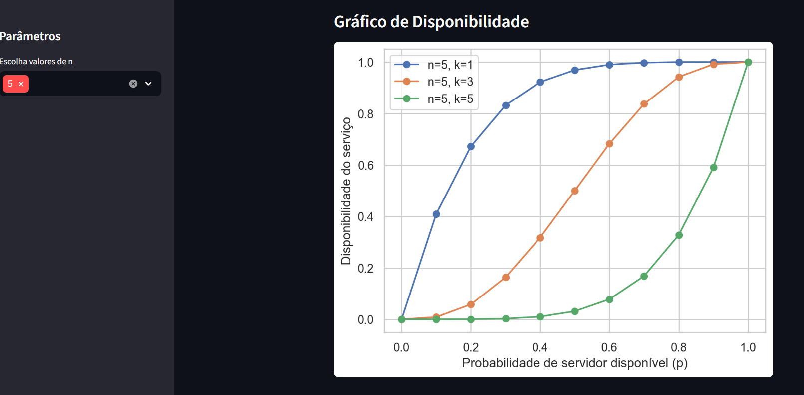
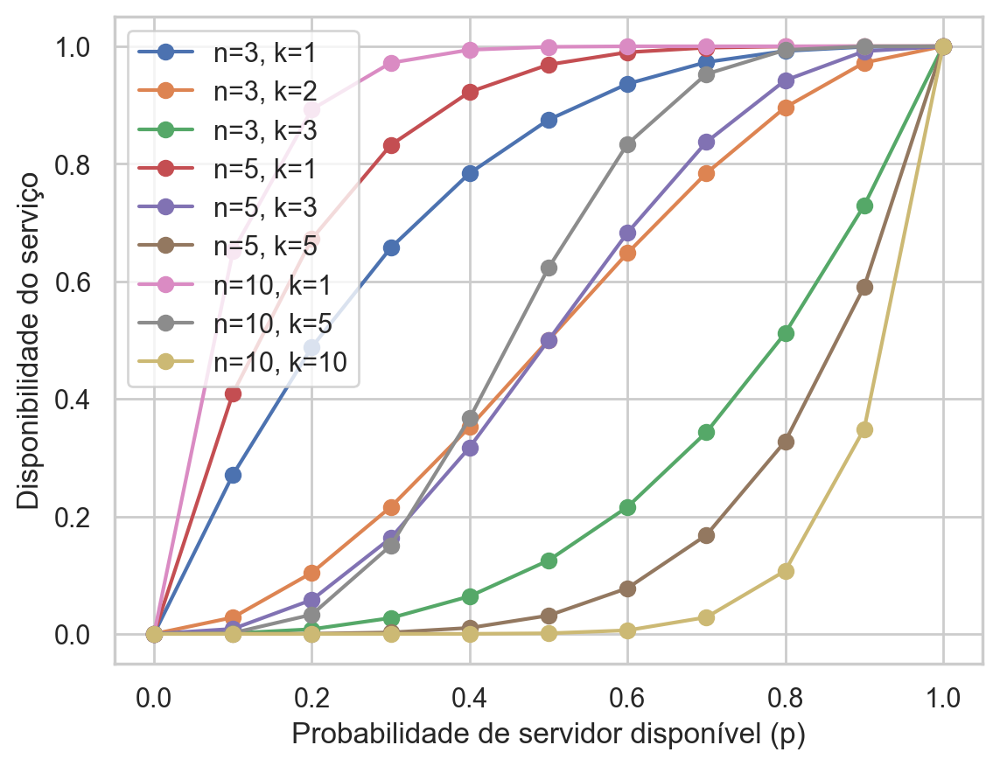
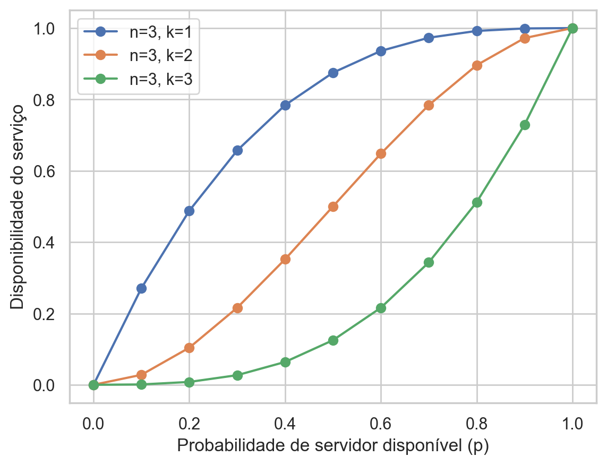
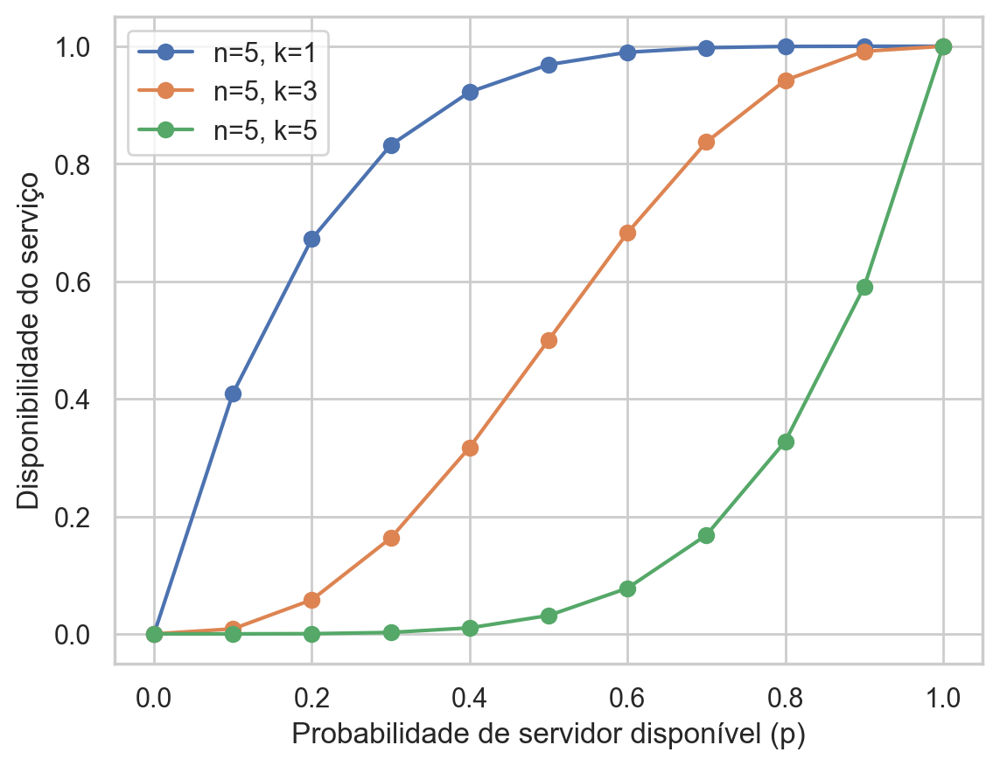
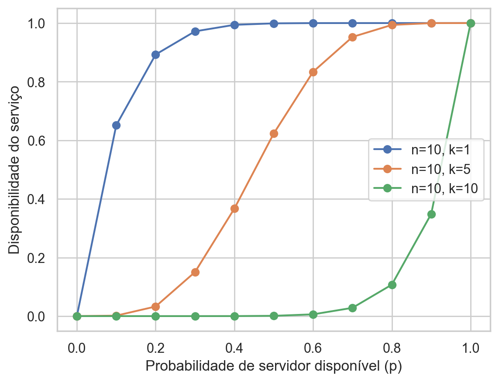

# Autor(es)

Projeto desenvolvido para a disciplina de **Computação Distribuída**.

* Igor Gomes Ximenes - 2217665  
* Gabriel Abreu - 2315097
* Kalil Smith - 2223857

---

# Cálculo Analítico e Simulação da Disponibilidade de Serviços Replicados

## Descrição

Este projeto foi desenvolvido para a disciplina de **Computação Distribuída** e tem como objetivo analisar a **disponibilidade de um serviço replicado** utilizando dois métodos distintos:

* **Cálculo analítico**, baseado em um modelo probabilístico.
* **Simulação estocástica**, realizada por meio de experimentos computacionais.

A comparação entre os resultados obtidos pelos dois métodos permite verificar se a simulação reproduz corretamente o comportamento previsto pela teoria.

## Relatórios

Os relatórios completos dos exercícios podem ser acessados abaixo:

- [Exercício 1.1](relatorio/Resolução_Exercício1.1.pdf)
- [Exercício 1.2](relatorio/Resolução_Exercício1.2.pdf)

## Estrutura do Repositório
```
├── interface/        # imagens da aplicacao funcionando
├── graficos/        # gráficos gerados pelo simulador
├── relatorio/       # relatórios dos exercícios
├── main.py          # aplicação Streamlit
├── requirements.txt # dependências do projeto
└── README.md
```
# Modelo Matemático

A disponibilidade de um serviço replicado em **n servidores**, que necessita de pelo menos **k servidores disponíveis**, pode ser calculada pela seguinte expressão:

A(n,k,p) = Σ C(n,i) · p^i · (1-p)^(n-i), para i = k até n

onde:

* **n** = número total de servidores
* **k** = número mínimo de servidores necessários para o funcionamento do serviço
* **p** = probabilidade de um servidor estar disponível

Essa fórmula soma as probabilidades de todos os estados em que o sistema permanece operacional.

---

# Simulação Estocástica

Além do cálculo analítico, foi implementado um simulador que estima a disponibilidade por meio de experimentos probabilísticos.

Cada rodada da simulação executa os seguintes passos:

1. Para cada servidor é gerado um número aleatório entre **0 e 1**.
2. O servidor é considerado disponível se o valor gerado for **menor ou igual a p**.
3. Conta-se quantos servidores estão disponíveis na rodada.
4. Verifica-se se o número de servidores disponíveis é **maior ou igual a k**.
5. O processo é repetido milhares de vezes.

A disponibilidade estimada corresponde à **frequência de rodadas em que o serviço permaneceu operacional**.

---

# Configuração dos Experimentos

Os experimentos foram realizados com os seguintes parâmetros:

* **n = 3, 5 e 10 servidores**
* **k = 1, ⌈n/2⌉ e n**
* **p variando de 0.0 até 1.0 com passo de 0.1**

Esses cenários representam diferentes configurações de sistemas replicados:

| Cenário   | Significado                                                     |
| --------- | --------------------------------------------------------------- |
| k = 1     | o sistema funciona se pelo menos um servidor estiver disponível |
| k = ⌈n/2⌉ | o sistema requer a maioria dos servidores                       |
| k = n     | o sistema requer todos os servidores disponíveis                |

---

# Resultados

Os resultados obtidos incluem:

* cálculo analítico da disponibilidade
* estimativa por simulação
* comparação entre os dois métodos

Pequenas diferenças entre os valores são esperadas devido à **natureza probabilística da simulação**.

---

# Visualização

O comportamento da disponibilidade em função da probabilidade **p** foi representado graficamente.

O gráfico mostra:

* disponibilidade analítica
* disponibilidade estimada por simulação
   
## Aplicação Online

A aplicação interativa pode ser acessada no link abaixo:

https://computacao-distribuida-ekjseaqemsapzj9edz5xoq.streamlit.app/

## Interface da Aplicação

A interface foi desenvolvida utilizando **Streamlit**, permitindo visualizar os resultados de forma interativa.




## Exemplos de gráficos gerados

### Disponibilidade para diferentes configurações



### Sistema com n = 3 servidores


### Sistema com n = 5 servidores


### Sistema com n = 10 servidores


---

# Como Executar o Projeto

## Requisitos

* Python 3
* bibliotecas:

```
pandas
matplotlib
seaborn
streamlit
```

## Instalação das dependências

Recomenda-se utilizar um ambiente virtual.

```
pip install -r requirements.txt
```

ou instalar manualmente:

```
pip install pandas matplotlib seaborn streamlit
```

---

## Executando a visualização interativa

Para visualizar os resultados de forma interativa:

```
streamlit run main.py
```

# Conclusão

Os experimentos demonstram que a simulação estocástica reproduz com grande precisão os valores previstos pelo modelo analítico.

À medida que o número de rodadas da simulação aumenta, os resultados estimados convergem para os valores teóricos, confirmando a validade do modelo probabilístico utilizado.

Esse tipo de análise é fundamental para compreender o comportamento de **sistemas distribuídos tolerantes a falhas**.

---


# Licença

Este projeto foi desenvolvido exclusivamente para **fins educacionais**.
